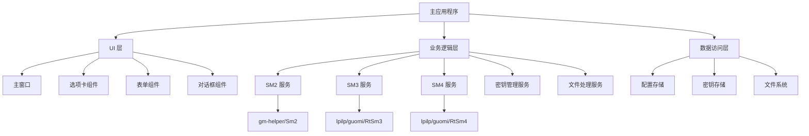
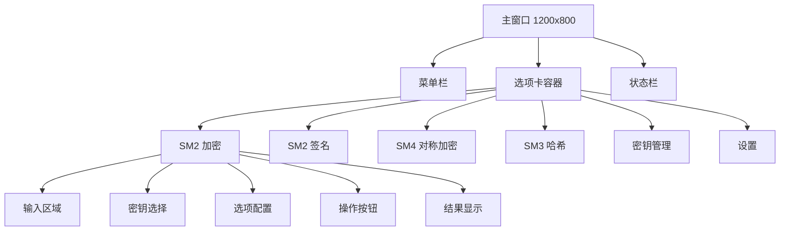

# 国密客户端设计文档

## 概述

国密客户端是一个基于 PHP 和 LibUI 的桌面应用程序，旨在展示国密算法（SM2、SM3、SM4）的完整使用场景。应用采用模块化架构设计，通过直观的图形界面为用户提供加密、解密、签名、验签、哈希计算等功能。

### 技术栈
- **GUI 框架**: kingbes-libui-sdk (基于 LibUI 的 PHP 封装)
- **国密算法**: yangweijie/gm-helper (SM2 优化版) + lpilp/guomi (SM2/SM3/SM4 基础实现)
- **语言**: PHP 8.0+
- **架构模式**: MVC + 事件驱动

## 架构设计

### 整体架构



### 目录结构

```
src/
├── Application/
│   ├── SmCryptoApp.php          # 主应用程序类
│   └── Config/
│       └── AppConfig.php        # 应用配置管理
├── UI/
│   ├── MainWindow.php           # 主窗口
│   ├── Components/
│   │   ├── CryptoTabPanel.php   # 加密选项卡面板
│   │   ├── FileSelector.php     # 文件选择组件
│   │   ├── KeyManager.php       # 密钥管理组件
│   │   └── ResultDisplay.php    # 结果显示组件
│   └── Dialogs/
│       ├── KeyGenerateDialog.php # 密钥生成对话框
│       ├── SettingsDialog.php    # 设置对话框
│       └── AboutDialog.php       # 关于对话框
├── Services/
│   ├── Crypto/
│   │   ├── Sm2Service.php       # SM2 加密服务
│   │   ├── Sm3Service.php       # SM3 哈希服务
│   │   └── Sm4Service.php       # SM4 对称加密服务
│   ├── KeyManagementService.php # 密钥管理服务
│   ├── FileService.php          # 文件处理服务
│   └── ConfigService.php        # 配置服务
├── Models/
│   ├── CryptoResult.php         # 加密结果模型
│   ├── KeyPair.php              # 密钥对模型
│   └── CryptoConfig.php         # 加密配置模型
└── Utils/
    ├── FormatConverter.php      # 格式转换工具
    ├── FileHelper.php           # 文件操作助手
    └── Validator.php            # 数据验证工具
```

## 组件和接口设计

### 核心服务接口

#### 1. 加密服务接口

```php
interface CryptoServiceInterface
{
    public function encrypt(string $data, array $options = []): CryptoResult;
    public function decrypt(string $data, array $options = []): CryptoResult;
    public function getSupportedFormats(): array;
    public function validateInput(string $data, array $options = []): bool;
}
```

#### 2. 密钥管理接口

```php
interface KeyManagementInterface
{
    public function generateKeyPair(): KeyPair;
    public function importKey(string $keyData, string $format): KeyPair;
    public function exportKey(KeyPair $keyPair, string $format): string;
    public function validateKey(string $keyData, string $format): bool;
    public function convertKeyFormat(string $keyData, string $fromFormat, string $toFormat): string;
}
```

#### 3. 文件服务接口

```php
interface FileServiceInterface
{
    public function readFile(string $path): string;
    public function writeFile(string $path, string $content): bool;
    public function selectFile(array $filters = []): ?string;
    public function saveFile(string $defaultName, array $filters = []): ?string;
    public function getFileInfo(string $path): array;
}
```

### UI 组件设计

#### 1. 主窗口布局



#### 2. SM2 加密选项卡

- **输入区域**: 多行文本框或文件选择
- **密钥管理**: 公钥/私钥选择下拉框，导入/生成按钮
- **选项配置**: 
  - 输出格式选择 (HEX/Base64)
  - C1 补 04 选项
  - 加密模式选择 (C1C3C2/C1C2C3)
- **操作按钮**: 加密/解密按钮
- **结果显示**: 只读文本框，复制按钮

#### 3. SM2 签名选项卡

- **输入区域**: 待签名数据输入
- **密钥管理**: 私钥选择，用户ID输入
- **选项配置**:
  - 输出格式选择 (HEX/Base64)
  - 签名格式选择 (ASN1/RS)
- **操作按钮**: 签名/验签按钮
- **结果显示**: 签名结果或验证结果

#### 4. SM4 对称加密选项卡

- **输入区域**: 明文输入或文件选择
- **密钥管理**: SM4 密钥输入 (16字节)，IV 输入/生成
- **选项配置**:
  - 加密模式选择 (ECB/CBC/CFB/OFB/CTR)
  - 输出格式选择 (HEX/Base64)
- **操作按钮**: 加密/解密按钮
- **结果显示**: 加密结果显示

#### 5. SM3 哈希选项卡

- **输入区域**: 文本输入或文件选择
- **操作按钮**: 计算哈希按钮
- **结果显示**: 哈希值显示，比较功能

## 数据模型

### 1. 加密结果模型

```php
class CryptoResult
{
    public bool $success;
    public string $data;
    public string $format;
    public ?string $error;
    public array $metadata;
    public float $executionTime;
}
```

### 2. 密钥对模型

```php
class KeyPair
{
    public string $publicKey;
    public string $privateKey;
    public string $format;
    public string $algorithm;
    public array $metadata;
    public DateTime $createdAt;
}
```

### 3. 加密配置模型

```php
class CryptoConfig
{
    public string $outputFormat = 'hex';
    public bool $appendZeroFour = false;
    public string $sm2Mode = 'C1C3C2';
    public string $sm4Mode = 'cbc';
    public string $signatureFormat = 'asn1';
    public string $keyStorePath = './keys';
}
```

## 错误处理策略

### 1. 错误分类

- **输入验证错误**: 数据格式不正确、长度不符合要求
- **密钥错误**: 密钥格式错误、密钥长度不正确、密钥不匹配
- **算法错误**: 加密/解密失败、签名验证失败
- **文件操作错误**: 文件不存在、权限不足、磁盘空间不足
- **系统错误**: 内存不足、依赖库错误

### 2. 错误处理机制

```php
class ErrorHandler
{
    public function handleCryptoError(Exception $e): CryptoResult;
    public function handleFileError(Exception $e): void;
    public function handleValidationError(string $field, string $message): void;
    public function showUserFriendlyError(string $message): void;
}
```

### 3. 用户反馈

- **成功提示**: 绿色状态栏消息，操作完成音效
- **警告提示**: 黄色对话框，需要用户确认
- **错误提示**: 红色对话框，详细错误信息和建议解决方案
- **进度提示**: 进度条显示，支持取消操作

## 测试策略

### 1. 单元测试

- **加密服务测试**: 测试各种输入格式和参数组合
- **密钥管理测试**: 测试密钥生成、转换、验证功能
- **格式转换测试**: 测试 HEX、Base64、ASN1 格式转换
- **数据验证测试**: 测试输入数据的各种边界情况

### 2. 集成测试

- **UI 组件集成**: 测试组件间的数据传递和事件处理
- **服务层集成**: 测试服务间的协作和数据流
- **文件操作集成**: 测试文件读写和错误处理

### 3. 用户界面测试

- **功能测试**: 验证所有功能按钮和输入框的正确性
- **用户体验测试**: 验证界面响应速度和操作流畅性
- **错误场景测试**: 验证各种错误情况下的用户提示

### 4. 性能测试

- **大文件处理**: 测试处理大文件时的内存使用和处理速度
- **批量操作**: 测试批量加密/解密的性能表现
- **并发操作**: 测试多个操作同时进行时的稳定性

## 安全考虑

### 1. 密钥安全

- **内存清理**: 使用完毕后立即清理内存中的密钥数据
- **文件权限**: 密钥文件设置严格的访问权限
- **加密存储**: 本地存储的密钥使用额外加密保护

### 2. 数据安全

- **输入验证**: 严格验证所有用户输入
- **缓冲区保护**: 防止缓冲区溢出攻击
- **临时文件**: 及时清理临时文件和敏感数据

### 3. 界面安全

- **密码输入**: 密钥输入框使用密码模式
- **剪贴板**: 提供清空剪贴板功能
- **屏幕截图**: 敏感数据区域防止截图

## 配置管理

### 1. 配置文件结构

```json
{
  "app": {
    "version": "1.0.0",
    "language": "zh-CN",
    "theme": "default"
  },
  "crypto": {
    "defaultOutputFormat": "hex",
    "sm2": {
      "appendZeroFour": false,
      "mode": "C1C3C2"
    },
    "sm4": {
      "defaultMode": "cbc",
      "autoGenerateIV": true
    },
    "signature": {
      "defaultFormat": "asn1",
      "defaultUserId": ""
    }
  },
  "storage": {
    "keyStorePath": "./keys",
    "configPath": "./config",
    "tempPath": "./temp"
  },
  "ui": {
    "windowWidth": 1200,
    "windowHeight": 800,
    "rememberWindowState": true
  }
}
```

### 2. 配置管理服务

- **配置加载**: 应用启动时自动加载配置
- **配置保存**: 设置更改时自动保存
- **配置验证**: 加载时验证配置的有效性
- **默认配置**: 配置文件缺失时使用默认值

## 部署和分发

### 1. 依赖管理

- **Composer**: 管理 PHP 依赖包
- **扩展检查**: 启动时检查必需的 PHP 扩展
- **版本兼容**: 确保与不同 PHP 版本的兼容性

### 2. 打包分发

- **可执行文件**: 使用 PHP 打包工具创建独立可执行文件
- **安装程序**: 提供简单的安装向导
- **更新机制**: 支持在线检查和更新

### 3. 平台支持

- **Windows**: 支持 Windows 10/11
- **macOS**: 支持 macOS 10.15+
- **Linux**: 支持主流 Linux 发行版